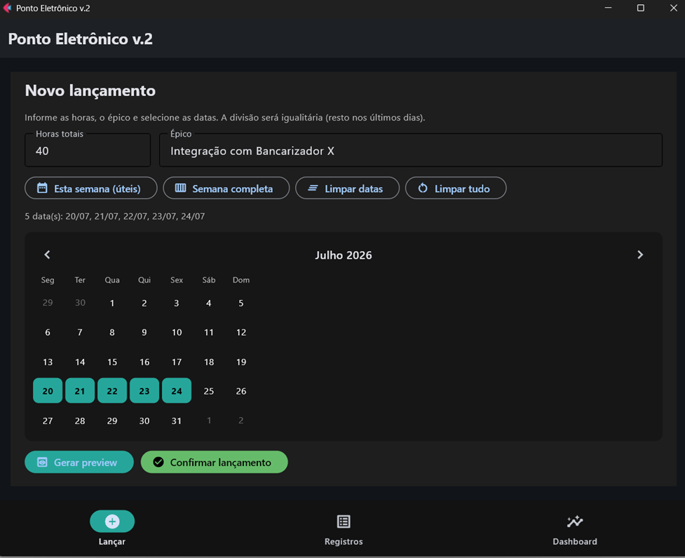
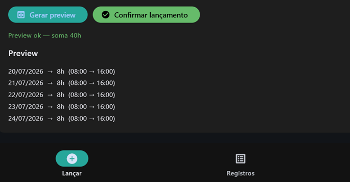
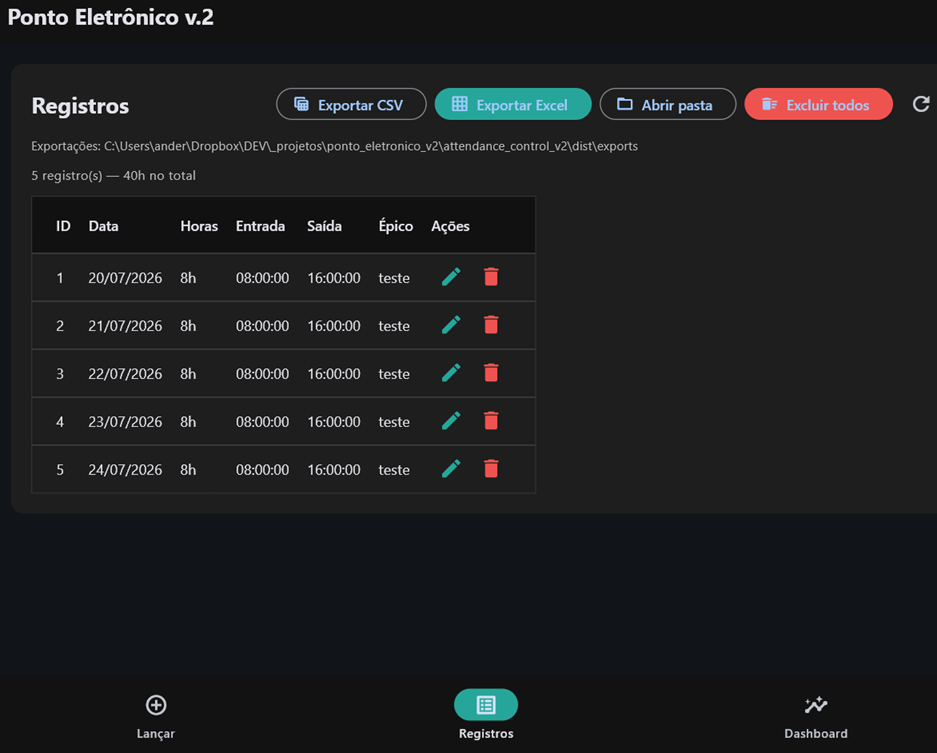
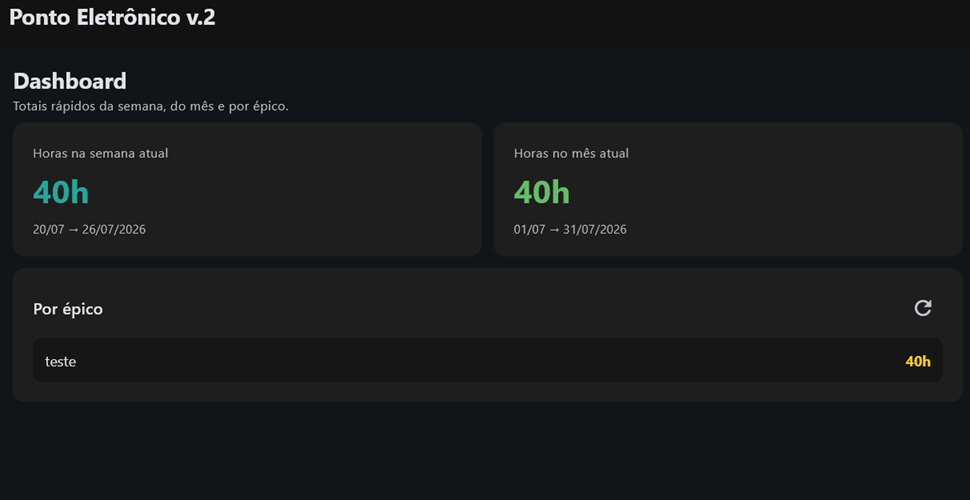

# Ponto Eletrônico v.2

App desktop para lançar horas por **épico** em múltiplas datas, com divisão igualitária, listagem, export no formato v1 e dashboard de totais.

> Projeto novo — **não altera** o `ponto_eletronico` (v1).  
> Decisões e roadmap: [`docs/PLANO.md`](docs/PLANO.md) · Riscos: [`docs/RISCOS.md`](docs/RISCOS.md)

---

## O que melhorou em relação à v1

A v1 (`ponto_eletronico`) funciona como **cronômetro**: bater entrada → bater saída em tempo real. Na prática, atrasar uma semana virava edição manual no SQLite.

A v2 muda o paradigma para **lançamento em lote**, pensado para jornada com horas fixas/variáveis na semana:

| | v1 | v2 |
|---|---|---|
| Fluxo | Entrada/saída ao vivo | Total de horas + datas + confirmar |
| Campo livre | Comentário | **Épico** |
| Datas | Sempre “hoje” | Multi-select + atalhos “esta semana” |
| Correção atrasada | Manual no banco | Fluxo nativo do app |
| UI | CustomTkinter | **Flet** (mais moderna) |
| Arquitetura | Tudo no `main.py` | Camadas (UI / services / repository / models) |
| Pós-lançamento | — | Lista, editar, excluir, excluir todos |
| Visão geral | — | **Dashboard** (semana / mês / por épico) |
| Export | CSV/XLSX | Mantém **formato v1** (compatível com o que o chefe já recebe) |
| Anti-erro | — | Trava de duplicata (mesmo épico + datas) |

### Telas

**Lançamento** — horas, épico, calendário multi-select e atalhos da semana:



**Preview** — divisão igualitária antes de confirmar:



**Registros** — listar, editar, excluir e exportar (formato v1):



**Dashboard** — totais da semana, do mês e por épico:



---

## Stack

- Python 3.10+
- [Flet](https://flet.dev/) (UI)
- SQLite (`data/ponto_v2.db`)
- pandas + openpyxl (export)

## Instalação

```bash
python -m venv .venv
.\.venv\Scripts\activate
pip install -r requirements.txt
```

## Executar

```bash
.\.venv\Scripts\python -m app.main
```

## Uso rápido

1. **Lançar** — informe horas totais + épico + selecione datas (multi-select ou atalho da semana)
2. Gere o **preview** e confirme
3. **Registros** — edite, exclua e exporte CSV/Excel (formato v1)
4. **Dashboard** — totais da semana, do mês e por épico

## Onde ficam os exports (CSV / Excel)

Pasta do projeto:

`attendance_control_v2\exports\relatorio_ponto_AAAA-MM-DD_HHMMSS.csv`

Na tela **Registros** o caminho completo aparece no topo e, ao exportar, o app abre a pasta automaticamente (botão **Abrir pasta**).

Se rodar pelo `.exe`, os arquivos ficam ao lado do executável:

`dist\exports\`

## Gerar / usar o .exe

```powershell
.\scripts\build_exe.ps1
```

Ou manualmente:

```powershell
.\.venv\Scripts\flet.exe pack run.py -n "PontoEletronicoV2" -y
```

Executável gerado em:

`dist\PontoEletronicoV2.exe`

Clique duas vezes para abrir. Banco e exports são criados na mesma pasta do `.exe` (`data\` e `exports\`).

## Estrutura

```
app/
  ui/           # telas Flet
  services/     # regras (split, export)
  repository/   # SQL
  models/       # dataclasses
  db/           # SQLite init
data/           # banco local
exports/        # CSV/XLSX gerados
img/            # screenshots do README
docs/PLANO.md   # esboço e decisões
docs/RISCOS.md  # riscos / hardening
```
